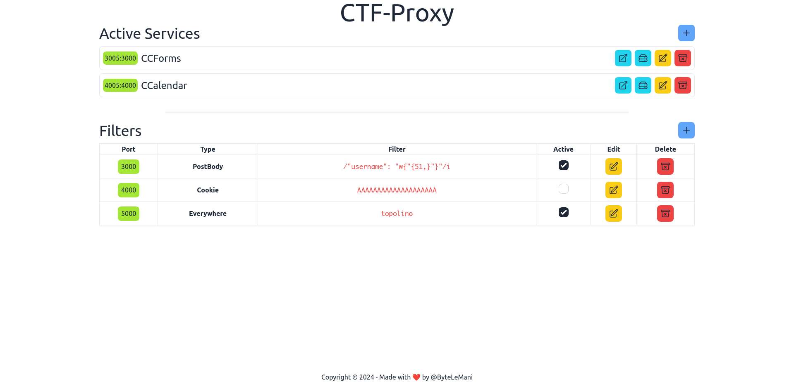

# Setup

## Developing
To setup everything run  `docker compose up --watch` and open `localhost:5173`

This will start two containers:
- Vite-Server, serving the front-end
- Language-Server, used by front-end code editor to add intellisense support

When you edit `package.json` it rebuilds everything to install new packages.

When you edit anything inside `/src` or `/language-server` it just sync the corresponding container which is running vite in hot-reload mode, so it will update dynamically

## Features
- [x] Filters editor
    - [x] Change type
    - [x] Change pattern
    - [x] Custom pattern with code editor ( :warning: still WIP)
        - [x] Intellisense support
        - [x] Proxy library support
    - [ ] Additional options (specific header, param length etc.)
    - [x] Change port
    - [x] HTTP Support
    - [ ] TCP Support   

- [ ] Services editor

## Screenshot

