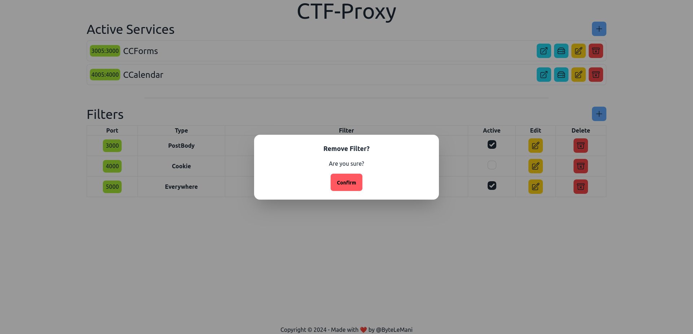

# Setup - TODO

To setup everything run run `docker compose up -d` and open `localhost:5173`

## Features
- [x] Filters editor
    - [x] Change type
    - [x] Change pattern
    - [ ] Custom pattern with code editor
    - [ ] Additional options (specific header, param length etc.)
    - [x] Change port
    - [x] HTTP Support
    - [ ] TCP Support   

- [ ] Services editor

## Screenshot

