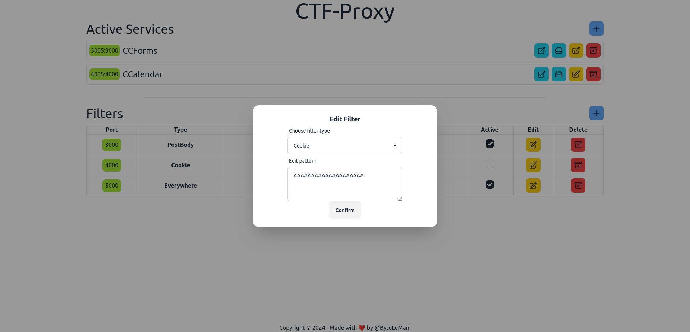

# Setup - TODO

To setup everything run  `docker compose up --watch` and open `localhost:5173`

This will start two containers:
- Vite-Server, serving the front-end
- Language-Server, used by front-end code editor to add intellisense support

## Features
- [x] Filters editor
    - [x] Change type
    - [x] Change pattern
    - [x] Custom pattern with code editor ( :warning: still WIP)
        - [ ] Adding Intellisense support and proxy libraries
    - [ ] Additional options (specific header, param length etc.)
    - [x] Change port
    - [x] HTTP Support
    - [ ] TCP Support   

- [ ] Services editor

## Screenshot

